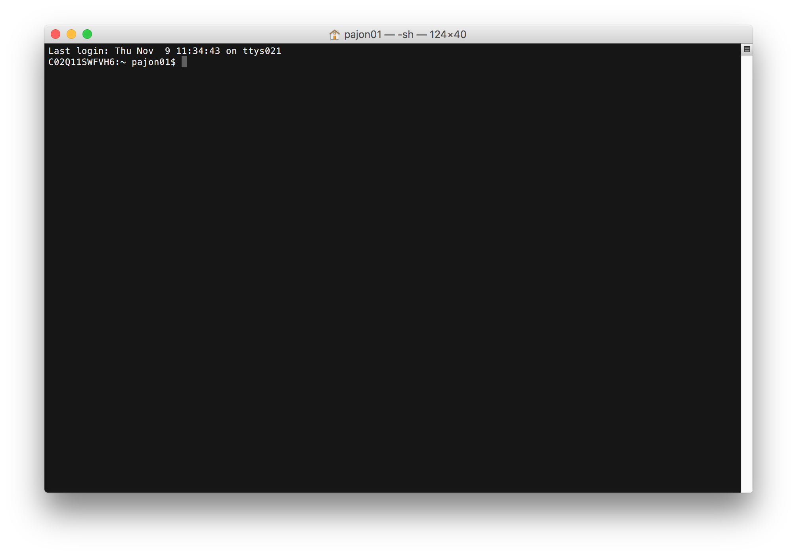
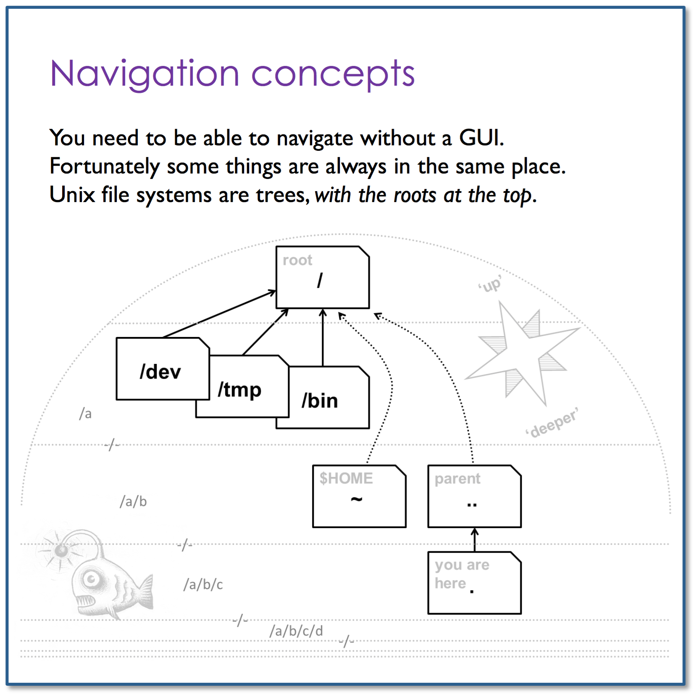
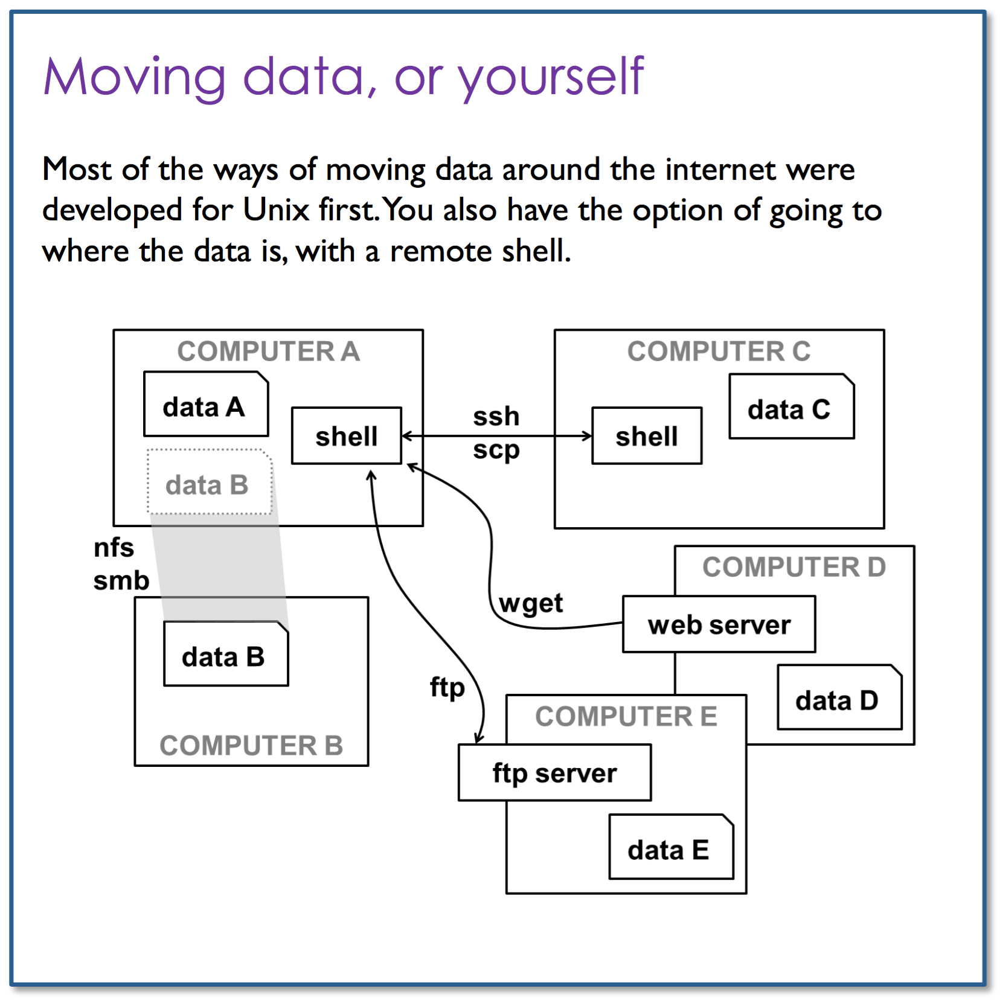

# Session 1: Shell

## Learning Objectives

- Use most useful shell commands
- Organise data into folders
- Log in onto the cluster
- Understand directories' structure
- Viewing reference genomes
- Retrieve sequencing data
- Merge datasets

## Basics, most useful shell commands

Open a Terminal window:


### Syntax

Remember the UNIX/LINUX command line is **case sensitive**!

- `$` indicates start of command
- `#` indicates end of command and start of comment

The `$` and `#` symbols are not part of the command.

`<...>` or `my_...` refers to variables and file names that need to be specified by the user. The arrows `<...>` need to be excluded, because they are generic UNIX redirection functions!

### Orientation

```shell
$ whoami   # shows as who you are logged in
$ hostname # shows on which machine you are
$ pwd      # present working directory

$ ls       # list directory contents of pwd
$ ls -l    # provides additional info on files and directories
$ ls -la   # includes hidden files (.name) as well
$ ls -lat  # lists files in chronological order
$ ls -R    # lists subdirectories recursively
$ man ls   # manual on command ls

$ cd <dir_name> # changes/switches into specified directory
$ cd ..         # moves one directory up
$ cd ../../     # moves two directories up (and so on)
$ cd            # brings you to highest level of your home directory
```

> :computer: **EXERCISE** [Download Session 1 data ](https://github.com/bioinformatics-core-shared-training/crukci-cluster-transition/raw/master/session1-data.zip), save file onto your computer and unzip it. The downloaded data contains Nelle Nemo's home directory. Nelle Nemo is a marine biologist, she has just returned from a six-month survey of the [North Pacific Gyre](http://en.wikipedia.org/wiki/North_Pacific_Gyre), where she has been sampling gelatinous marine life in the [Great Pacific Garbage Patch](http://en.wikipedia.org/wiki/Great_Pacific_Garbage_Patch).
>
> Open a Terminal window, navigate to the downloaded file and enter into its contents, go to `nelle` directory. Draw a diagram of `nelle`'s directories and files structure. Do not use a graphical interface, only the command line please!
>
> :tada: Congratulations! :thumbsup: You did it! :wink:  

> See [images/homedir.png](images/homedir.png) for the answer


### Files and directories

```shell
$ mkdir <dir_name> # creates specified directory
$ rmdir <dir_name> # removes empty directory

$ nano <file_name> # create a file using the text editor nano

$ rm <file_name>   # removes file name
$ rm -r <dir_name> # removes directory including its content, but asks for confirmation, 'f' argument turns confirmation off

$ mv <name1> <name2> # renames directories or files
$ mv <name> <path>   # moves file/directory as specified in path

$ cp <name> <path>   # copy file/directory as specified in path (-r to include content in directories)
```

When we say, "nano is a text editor", we really do mean "text": it can only work with **plain character data**, not tables, images, or any other human-friendly media. We use it in examples because almost anyone can drive it anywhere without training, but please use something more powerful for real work. On Unix systems (such as Linux and Mac OS X), many programmers use [Emacs](http://www.gnu.org/software/emacs/) or [Vim](http://www.vim.org/) (both of which are completely unintuitive, even by Unix standards), or a graphical editor such as [Atom](https://atom.io/) which is not available from the cluster.

> :computer: **EXERCISE** Go back to your Terminal window, or open a new one and navigate to `session1-data/nelle`
>
> - Create a new directory `thesis` and create a file `draft.txt` in it. Type this line `It's not "publish or perish" any more, it's "share and thrive"!` if you wish and save.
> - Navigate back to `session1-data/nelle` and delete `thesis` directory.
> - Let's create that directory and file one more time.
> - `draft.txt` isn't a particularly informative name, so let's change it to `quotes.txt`
> - Let's now move `quotes.txt` into `nelle` directory
> - Copy `quotes.txt` into `thesis` directory as `quotations.txt` file
>
> :tada: Congratulations! :thumbsup: You did it! :wink:  

:warning: With Great Power Comes Great Responsibility. When the files and directories are deleted, there is no way back. They are totally gone forever.

### Copy and paste

Depends on local environment. Usually one of the following methods works:

- Copy: Ctrl&Shift&c or right/middle mouse click
- Paste: Ctrl&Shift&p or right/middle mouse click

### Handy shortcuts

```shell
$ ~/                              # refers to user's home directory
$ history                         # shows all commands you have used recently
$ !<number>                       # starts an old command by providing its ID number
$ up(down) key                    # scrolls through command history
$ <incomplete path/file_name> TAB # completes path/file_name
$ <incomplete command> SHIFT&TAB  # completes command
$ Ctrl a                          # cursor to beginning of command line
$ Ctrl e                          # cursor to end of command line
```

### Filters and pipes

Now that we know a few basic commands, we can finally look at the shell's most powerful feature: the ease with which it lets us **combine existing programs in new ways**. We'll start with a directory called `molecules` that contains six files describing some simple organic molecules. The `.pdb` extension indicates that these files are in Protein Data Bank format, a simple text format that specifies the type and position of each atom in the molecule. Which of these molecules have the smallest number of atoms?

```shell
$ wc -l <file_name> # counts the number of lines in each input file
$ ls *.txt          # list files with name matching zero or more characters and ends with .txt
```

When the shell sees a wildcard, it expands the wildcard to create a **list of matching filenames** before running the command that was asked for.

> :computer: **EXERCISE** Go back to your Terminal window, or open a new one and navigate to `session1-data/nelle/molecules`. So, which of these molecules have the smallest number of atoms?
>
> - First, list only the molecules which start with the letter `p`. How many are they?
> - Now, get the numbers of lines for each molecule. Can you do it with only one command?
>
> :tada: Congratulations! :thumbsup: You did it! :wink:


Which of these molecules have the smallest number of atoms? It's an easy question to answer when there are only six files, but what if there were 6000? We will **redirect** the output of the command `wc -l` into a file instead of printing it to the screen using the greater than symbol `>`.

```shell
$ wc -l <file_name> > length.txt  # redirects the command's output to a file length.txt
$ cat <file_name_a> <file_name_b> # prints the contents of files one after another
$ sort -n <file_name>             # sorts lines of text file in numerical order instead of alphabetical
$ head -1 <file_name>             # gets the first line of the file, use -4 to get the first 4 and so on
```

Instead of creating enormous programs that try to do many different things, Unix programmers focus on creating **lots of simple tools** that each do one job well, and that work well with each other. This programming model is called "pipes and filters".

We've already seen **filters**; a filter is a program like `wc` or `sort` that transforms a stream of input into a stream of output. Almost all of the standard Unix tools can work this way: unless told to do otherwise, they read from **standard input**, do something with what they've read, and write to **standard output**.

To combine these programs, we use the vertical bar between two commands which is called a **pipe** `|`. It tells the shell that we want to use the output of the command on the left as the input to the command on the right.

```shell
$ wc -l <file_names> | sort -n  # standard output of wc is fed directly to the standard input of sort
```

> :computer: **EXERCISE** Go back to your Terminal window, or open a new one and navigate to `session1-data/nelle/north-pacific-gyre/2012-07-03`. Nelle has 300 samples in all, and ran each sample through an assay machine that will measure the relative abundance of 300 different proteins. The machine's output for a single sample is a file with one line for each protein.
>
> - How many assay result files does she have?
> - Could you check that each file has 300 measurements as expected?
>
> :tada: Congratulations! :thumbsup: You did it! :wink:


## Navigation recap



## Connecting to Cluster

### Moving data, or yourself




### Accessing Remote Server

`ssh` (Secure Shell) is a network protocol that allows a secure access over an encrypted connection. Through an SSH connection you can easily manage your files and folders, modify their permissions, edit files directly on the server, configure and install your scripts, etc. `ssh` is used to securely login to a Linux / UNIX host running the sshd daemon on a reachable network.

First, you need a cluster account, request one via Helpdesk - IT <ithelpdesk@cruk.cam.ac.uk>.

Access the cluster at `clust1-headnode.cri.camres.org` using the `ssh` command and your username, press enter and type your password.

```shell
$ ssh my_username@clust1-headnode.cri.camres.org
```

At this point, you are physically on the cluster head node inside your home directory. The directory structure is now completely different to the one you had before and you can no-longer access the files within your file system. However, you can still use the same commands you have seen already. If you now type these commands the outputs will now be specific to you and to the server your are running them on. To return to your computer, use the command `exit`.

```shell
$ exit
```

> :computer: **EXERCISE** Go back to your Terminal window, or open a new one and log in onto the cluster head node.
>
> - What is the full path of your home directory?
> - Do you have any files? How many?
> - Return to your own computer, make sure your hostname is your own machine.
>
> :tada: Congratulations! :thumbsup: You did it! :wink:

## Cluster directories' structure

- Home directory: `/home/$username`
- Shared installed software: `/home/bioinformatics/software`
- Scratch/working areas: `/mnt/scratcha` and `/mnt/scratchb`
- Reference data: `/mnt/scratchb/bioinformatics/reference_data`

The two scratch/working areas are separate but equivalent. These areas are (deliberately) not backed, they are a massively parallel distributed file system
called Lustre. Pick one to do your work, and to make best use vary which one to use.

Large files may need to be stripped to improve performance or files that many jobs reads. See `lfs setstripe --help` for help.

Limit number of files in directory, if possible avoid 10,000s files in single directory.

> :computer: **EXERCISE** Go back to your Terminal window, or open a new one and log in onto the cluster head node.
>
> - Go to the bioinformatics shared installed software and list what's installed.
> - Go to one of the scratch spaces to find your lab folder.
> - Create a directory under your lab folder in the scratch area using your username for its name e.g. `/scratchb/bioinformatics/pajon01`
>
> :tada: Congratulations! :thumbsup: You did it! :wink:


## Reference genomes

- Path to reference genomes: `/scratchb/bioinformatics/reference_data/reference_genomes/`
- Path to assembly: `/scratchb/bioinformatics/reference_data/reference_genomes/$organism/$assembly` e.g. for Human GRCh38 `/scratchb/bioinformatics/reference_data/reference_genomes/homo_sapiens/GRCh38`

What Bioinformatics Core maintains:
- Genome sequence (fasta)
- Alignment indices: BWA, TopHat, Bowtie (1, 2)
- Annotations:
  - GTF format gene model
  - RefFlat format gene model
  - Signal artifact list (if available)

> :computer: **EXERCISE** Go back to your Terminal window, or open a new one and log in onto the cluster head node.
>
> - Go to the bioinformatics shared reference genomes and list the assemblies installed for Homo Sapiens.
>
> :tada: Congratulations! :thumbsup: You did it! :wink:


## Getting sequencing data

### Downloading Files

The `wget` utility is the best option to **download files from the internet**. It can pretty much handle all complex download situations including large file downloads, recursive downloads, non-interactive downloads, multiple file downloads etc. It retrieves files from World Wide Web (WWW) using widely used protocols like HTTP, HTTPS and FTP, and is designed in such way so that it works in slow or unstable network connections. `wget` can automatically re-start a download where it was left off in case of network problem. Also it downloads file recursively and will keep trying until file has be retrieved completely.

```shell
$ wget ftp://ftp.sra.ebi.ac.uk/vol1/fastq/SRR000/SRR000731/SRR000731.fastq.gz
```

> :computer: **EXERCISE** Go back to your Terminal window, or open a new one and log in onto the cluster head node.
>
> - Go to your directory under your lab folder in the scratch area e.g. `/scratchb/bioinformatics/pajon01`
> - Download this FASTQ file [ftp://ftp.sra.ebi.ac.uk/vol1/fastq/SRR000/SRR000731/SRR000731.fastq.gz](ftp://ftp.sra.ebi.ac.uk/vol1/fastq/SRR000/SRR000731/SRR000731.fastq.gz)
>
> :tada: Congratulations! :thumbsup: You did it! :wink:


### Copying Files and Directories

`ssh` protocol can also be used to copy files & directories, using the same connection method as above but the command we use is called `scp`.

```shell
scp -r molecules/ my_username@clust1-headnode.cri.camres.org:/scratchb/xxlab/my_username/
```

> :computer: **EXERCISE** Go back to your Terminal window, or open a new one and navigate to `session1-data/nelle`.
>
> - Copy the `molecules` directory into your directory under your lab folder in the scratch area on the cluster.
> - Log in to the cluster and navigate to your scratch folder. Check that the molecule files are present.
>
> :tada: Congratulations! :thumbsup: You did it! :wink:


### Using CRUKCI infrastructure

The Bioinformatics Core provides a tool for downloading files for projects, libraries and runs that you can use from the command line or integrate into your Java application. This is available internally from:
http://intranet.cri.camres.org/core-facilities/bioinformatics/sequencing/api

Save [this file](http://internal-bioinformatics.cruk.cam.ac.uk/software/clarity-tools.jar) to your working area. You can run the tool from the command line with:

```shell
$ wget http://internal-bioinformatics.cruk.cam.ac.uk/software/clarity-tools.jar
$ java -jar clarity-tools.jar --help
```

To download all sequencing files associated to your SLX-14572, you can use this command:

```shell
$ java -jar /path/to/clarity-tools.jar -l SLX-14572
```

> :computer: **EXERCISE** Go back to your Terminal window, or open a new one and log in onto the cluster head node.
>
> - Download Clarity tool in your home directory
> - Navigate to your scratch folder.
> - Download your preferred project data.
>
> :tada: Congratulations! :thumbsup: You did it! :wink:


## Merging datasets

To merge or concatenate multiple FASTQ files, you do not need to decompress them. It can be done using the `cat` command and redirecting its output to a new file.

```
wget ftp://ftp.sra.ebi.ac.uk/vol1/fastq/ERR056/ERR056477/ERR056477.fastq.gz
wget ftp://ftp.sra.ebi.ac.uk/vol1/fastq/ERR056/ERR056478/ERR056478.fastq.gz

cat ERR056477.fastq.gz ERR056478.fastq.gz > PRJEB2772.fastq.gz
```

> :computer: **EXERCISE** Go back to your Terminal window, or open a new one and log in onto the cluster head node.
>
> - Navigate to your scratch folder.
> - Download two FASTQ files and merge them.
>
> :tada: Congratulations! :thumbsup: You did it! :wink:


## Take home message: everyday commands

```shell
$ pwd           # present working directory
$ ls            # list directory contents of pwd
$ cd <dir_name> # changes/switches into specified directory

$ mkdir <dir_name> # creates specified directory

$ nano <file_name> # create a file using the text editor nano
$ cat <file_name>  # prints the contents of files one after another

$ rm <file_name>   # removes file name
$ rm -r <dir_name> # removes directory including its content, but asks for confirmation, 'f' argument turns confirmation off

$ mv <name1> <name2> # renames directories or files
$ mv <name> <path>   # moves file/directory as specified in path

$ cp <name> <path>   # copy file/directory as specified in path (-r to include content in directories)

$ wget ftp://ftp.sra.ebi.ac.uk/vol1/fastq/ERR056/ERR056477/ERR056477.fastq.gz  # download files from the internet
$ scp -r molecules/ clust1-headnode:/scratchb/xxlab/my_username/               # copy files & directories between different computers

$ ssh my_username@clust1-headnode.cri.camres.org  # access a remote computer
$ exit                                            # exit ;)
```

## Reference materials

- [The Unix Shell](http://bioinformatics-core-shared-training.github.io/shell-novice/index.html)
- [LINUX ESSENTIALS](http://faculty.ucr.edu/~tgirke/Documents/UNIX/linux_manual.html)
